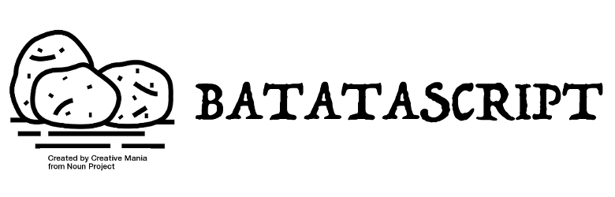

## 🥔 BatataScript 🥔

> "You harvest what you plant"

**Batatascript** is rural paradigm language that turns javascript code into javascript code 🥔 => 🍟

## Installing
```bash
yarn add batatascript
# or...
npm install batatascript
```

## Configuring your .batatarc
*TODO*

## Usage command line

#### 1 - Write batatascript code
*hello.btts*
```javascript
console.log('Hello World 🍟');
```

#### 2 - Running batatascript code
```bash
batatascript hello.btts # Hello World 🍟
```

## Batata plugins

- batata-preset-react(*In progress*)
- batata-jest(*In progress*)
- batata-flow(*In progress*)
- batata-ramda(*In progress*)
